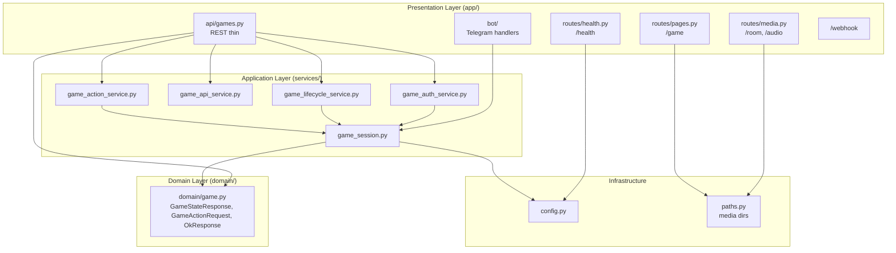

# ארכיטקטורה – Layered Architecture

הפרויקט בנוי ב-**Layered Architecture** (ארכיטקטורה בשכבות), המקובלת בתעשייה לאפליקציות web ו-API בגודל בינוני. השכבות מוגדרות כך: **Presentation → Application → Domain**, עם **Infrastructure** כבסיס.

## למה Layered ולא DDD?

- **Layered** מתאימה לפרויקטים עם לוגיקה ברורה, מעט bounded contexts, ו-API/CRUD-אוריינטד. קל לתחזוקה והבנה.
- **DDD** מתאימה יותר כשהדומיין מורכב, עם הרבה כללים עסקיים ו-contexts נפרדים. כאן הדומיין (משחק, הרשמה, שחקנים) פשוט יחסית.
- אם בעתיד יתווספו מנוע סיפור, אירועים, או מספר סוגי משחק – אפשר להכניס אלמנטים DDD-ish (aggregates, domain events) בתוך השכבות.

---

## סכמה – שכבות והתמצאות

---

## שכבות בפועל

| שכבה | תיקייה | תפקיד |
|------|--------|--------|
| **Presentation** | `app/` | API (REST), דפים (/game), health (/health), בוט טלגרם, webhook. רק קלט/פלט – קורא ל-Application. |
| **Application** | `services/` | לוגיקת שימוש: הרשמה, יצירת משחק, אחסון בזיכרון. משתמש ב-Domain כ-schema. |
| **Domain** | `domain/` | טיפוסים משותפים (TypedDict + Pydantic): `GameStateResponse`, `GameActionRequest`, `GameActionResponse`, `OkResponse`, `HealthResponse`. חוזה בין API ל-Application. |
| **Infrastructure** | `config.py`, `paths.py`, `utils/` | הגדרות (env, PORT, MODE, base_url), נתיבי מדיה ופרויקט. ללא לוגיקה עסקית. |

---

## קבצים עיקריים

- **`app/main.py`** – חיבור בלבד: routers (api, ws, pages, health, media), mount ל-static, webhook, startup (בוט). ללא route handlers של מדיה או הגדרת paths.
- **`paths.py`** – קבועי נתיבים (IMAGES_DIR, ROOM_ASSETS_DIR, AUDIO_DIR, FRONTEND_DIST, LORE_WAV_PATH). בשימוש ב-main ו-`routes/media`.
- **`app/routes/media.py`** – הגשת מדיה: `/room/escape_room.png`, `/room/door_open.mp4`, `/room/science_lab_room.png`, `/audio/lore.wav`.
- **`app/routes/health.py`** – קובץ ייעודי ל-health. מחזיר `{"status": "awake", "mode": "production"}`.
- **`app/api/games.py`** – API משחק (endpoints דקים): אימות דרך `game_auth_service`, לוגיקה ב-`game_api_service`, `game_lifecycle_service`, `game_action_service`.
- **`services/game_auth_service.py`** – `get_game_for_request`: טעינת משחק, אימות initData, late join. זורק HTTPException ב-401/404.
- **`services/game_lifecycle_service.py`** – `record_game_start`, `handle_time_up`, `handle_door_opened`.
- **`services/game_action_service.py`** – `submit_puzzle_action`: ולידציה, השוואת תשובה, עדכון state, broadcast.
- **`services/game_api_service.py`** – `apply_demo_room`, `build_game_state_response`, `needs_demo_room`, `item_label`, `all_unlock_puzzles_solved`.
- **`domain/game.py`** – סכמות: `GameStateResponse`, `GameActionRequest`, `GameActionResponse`, `OkResponse`, `HealthResponse`.
- **`config.py`** – env, PORT, MODE, base_url.
- **`docs/API_CONTRACT.md`** – חוזה API: endpoints, request/response schemas, אירועי WebSocket.

---

## כיוון זרימה

- **Presentation** → קורא ל-**Application** (ו-**Infrastructure** כשצריך).
- **Application** → משתמש ב-**Domain** (טיפוסים) וב-**Infrastructure** (config).
- **Domain** – ללא תלויות בשכבות אחרות; רק טיפוסים/חוזים.

---

## זרימת משחק (בוט) – Game flow & UX

פירוט מלא: **`docs/BOT_GAME_FLOW.md`**.

- **התחלה:** מישהו בקבוצה כותב `/start_game` → הבוט שולח הודעה עם "אני רוצה לשחק" ו"כולם פה, אפשר להתחיל".
- **הרשמה:** כל חבר בקבוצה יכול ללחוץ "אני רוצה לשחק" (נרשם לרשימה). **כולם פה** – כל מי שרואה את ההודעה יכול ללחוץ; ברגע שלוחצים נוצר `game_id` ומופיעה הודעה חדשה עם כפתור **שחק עכשיו** (Web App). הכפתור הוא הכניסה למשחק; אין צורך להעתיק קישור.
- **הצטרפות מאוחרת:** מי שנכנס לקבוצה אחרי שכבר לחצו "כולם פה" יראה את ההודעה עם הכפתור (או יקבל בברכת הצטרפות כפתור אם יש משחק פעיל). בלחיצה על הכפתור הוא נכנס ל-Web App; בבקשה הראשונה ל-API הוא מתווסף אוטומטית לרשימת השחקנים (late join) ומקבל עדכונים בזמן אמת.
- **סיום משחק:** (1) הטיימר הגיע ל-0 → Game Over, הבוט שולח הודעה. (2) **רק מי שכתב `/start_game`** יכול לכתוב `/end_game` כדי לסיים את המשחק ידנית.

---

## סטטוס חידות משותף לכל קבוצה

סטטוס החידות (נפתר/לא נפתר) **משותף לכל חברי הקבוצה בלבד**. כל משחק מזוהה ב־`game_id` יחיד; הנתונים (כולל `room_solved`) נשמרים ב־Redis (מפתח `game:{game_id}`) או בזיכרון ב־`game_session`. קבוצות שונות מקבלות `game_id` שונה ולכן נתונים מופרדים. כששחקן פותר חידה, השרת מעדכן את `room_solved`, שומר, ומשדר אירוע `puzzle_solved` לכל חיבורי ה־WebSocket של אותו משחק – כך כל השחקנים רואים את אותו סטטוס. תלויות בין חידות (למשל לוח הבקרה רק אחרי השעון) מוגדרות ב־`data/puzzle_dependencies.py` ונאכפות ב־`game_action_service`.

---

## מבנה הפרונט (frontend/src)

- **`pages/GamePage.tsx`** – אורקסטרציה: state, effects, ו-render של המבנה הראשי. מייבא קומפוננטות ו-constants.
- **`components/`** – קומפוננטות לשימוש חוזר: `Banners`, `StartUI`, `RoomView`, `TaskModal`, `DoorVideoOverlay`, `ScienceLabRoom`.
- **`constants/`** – `messages.ts` (הודעות למשתמש), `roomHotspots.ts` (צורות hotspots, טיימר, `getDoorVideoSrc`, `formatTimer`).
- **`utils/gameHelpers.ts`** – `getPuzzles`, `getPuzzleByItemId` (עזרים על `GameStateResponse`).
- **`types/game.ts`** – re-export של טיפוסי משחק מ-`api/client`.
- **`api/client.ts`** – מקור יחיד לקריאות API ולטיפוסי תגובה.
