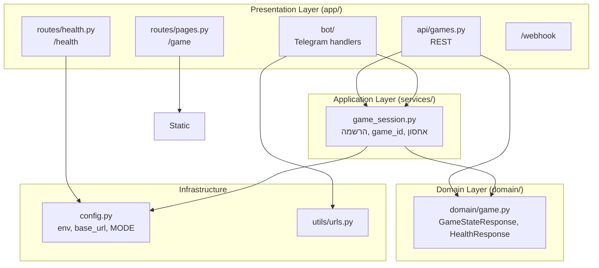

# ארכיטקטורה – Layered Architecture

הפרויקט בנוי ב-**Layered Architecture** (ארכיטקטורה בשכבות), המקובלת בתעשייה לאפליקציות web ו-API בגודל בינוני. השכבות מוגדרות כך: **Presentation → Application → Domain**, עם **Infrastructure** כבסיס.

## למה Layered ולא DDD?

- **Layered** מתאימה לפרויקטים עם לוגיקה ברורה, מעט bounded contexts, ו-API/CRUD-אוריינטד. קל לתחזוקה והבנה.
- **DDD** מתאימה יותר כשהדומיין מורכב, עם הרבה כללים עסקיים ו-contexts נפרדים. כאן הדומיין (משחק, הרשמה, שחקנים) פשוט יחסית.
- אם בעתיד יתווספו מנוע סיפור, אירועים, או מספר סוגי משחק – אפשר להכניס אלמנטים DDD-ish (aggregates, domain events) בתוך השכבות.

---

## סכמה – שכבות והתמצאות

---

## שכבות בפועל

| שכבה | תיקייה | תפקיד |
|------|--------|--------|
| **Presentation** | `app/` | API (REST), דפים (/game), health (/health), בוט טלגרם, webhook. רק קלט/פלט – קורא ל-Application. |
| **Application** | `services/` | לוגיקת שימוש: הרשמה, יצירת משחק, אחסון בזיכרון. משתמש ב-Domain כ-schema. |
| **Domain** | `domain/` | טיפוסים משותפים (TypedDict): `GameStateResponse`, `HealthResponse`. חוזה בין API ל-Application. |
| **Infrastructure** | `config.py`, `utils/` | הגדרות (env, PORT, MODE, base_url), URLs. ללא לוגיקה עסקית. |

---

## קבצים עיקריים

- **`app/main.py`** – חיבור בלבד: routers, mount ל-static, webhook, startup (בוט). לא לוגיקה.
- **`app/routes/health.py`** – **קובץ ייעודי** ל-health. מחזיר `{"status": "awake", "mode": "production"}` (הסקריפט החיצוני קורא ל-`GET /health`).
- **`app/api/games.py`** – API משחק; משתמש ב-`services.game_session` וב-schema מ-`domain.game`.
- **`domain/game.py`** – סכמה: `GameStateResponse`, `HealthResponse` (לשימוש ב-API ובהודעות).
- **`config.py`** – `MODE = os.getenv("ENV", "production")` לשימוש ב-health ו-reload.

---

## כיוון זרימה

- **Presentation** → קורא ל-**Application** (ו-**Infrastructure** כשצריך).
- **Application** → משתמש ב-**Domain** (טיפוסים) וב-**Infrastructure** (config).
- **Domain** – ללא תלויות בשכבות אחרות; רק טיפוסים/חוזים.
