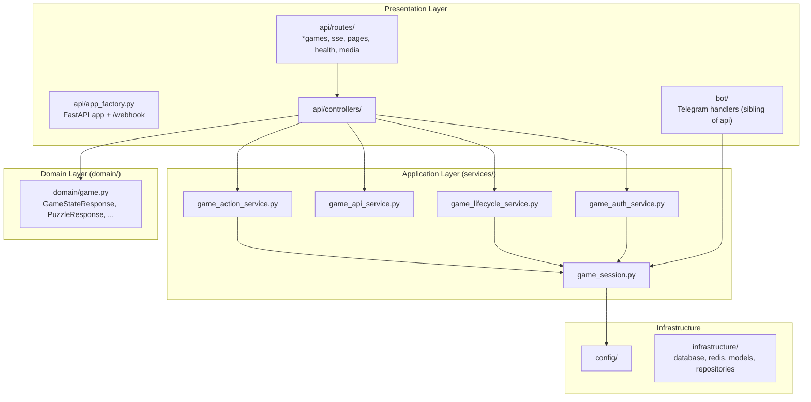

# ארכיטקטורה – Layered Architecture

הפרויקט בנוי ב-**Layered Architecture** (ארכיטקטורה בשכבות), המקובלת בתעשייה לאפליקציות web ו-API בגודל בינוני. השכבות מוגדרות כך: **Presentation → Application → Domain**, עם **Infrastructure** כבסיס.

## למה Layered ולא DDD?

- **Layered** מתאימה לפרויקטים עם לוגיקה ברורה, מעט bounded contexts, ו-API/CRUD-אוריינטד. קל לתחזוקה והבנה.
- **DDD** מתאימה יותר כשהדומיין מורכב, עם הרבה כללים עסקיים ו-contexts נפרדים. כאן הדומיין (משחק, הרשמה, שחקנים) פשוט יחסית.
- אם בעתיד יתווספו מנוע סיפור, אירועים, או מספר סוגי משחק – אפשר להכניס אלמנטים DDD-ish (aggregates, domain events) בתוך השכבות.

---

## סכמה – שכבות והתמצאות

```mermaid
flowchart TB
    subgraph Presentation["Presentation Layer"]
        AppFactory["api/app_factory.py\nFastAPI app + /webhook"]
        Routes["api/routes/\n*games, sse, pages, health, media"]
        Controllers["api/controllers/"]
        Bot["bot/\nTelegram handlers (sibling of api)"]
    end

    subgraph Application["Application Layer (services/)"]
        GameSession["game_session.py"]
        GameAuth["game_auth_service.py"]
        GameAPI["game_api_service.py"]
        GameLifecycle["game_lifecycle_service.py"]
        GameAction["game_action_service.py"]
    end

    subgraph Domain["Domain Layer (domain/)"]
        Schema["domain/game.py\nGameStateResponse, PuzzleResponse, ..."]
    end

    subgraph Infrastructure["Infrastructure"]
        Config["config/"]
        Infra["infrastructure/\ndatabase, redis, models, repositories"]
    end

    Routes --> Controllers
    Controllers --> GameAuth
    Controllers --> GameAPI
    Controllers --> GameLifecycle
    Controllers --> GameAction
    Controllers --> Schema
    Bot --> GameSession
    GameAuth --> GameSession
    GameLifecycle --> GameSession
    GameAction --> GameSession
    GameSession --> Config
```

---

## שכבות בפועל

| שכבה | תיקייה | תפקיד |
|------|--------|--------|
| **Presentation** | `api/` (REST), `bot/` (Telegram) | `api/`: routes, controllers, בניית FastAPI ו־/webhook. `bot/`: אפליקציית טלגרם (handlers). שניהם קוראים ל-Application. |
| **Application** | `services/` | לוגיקת שימוש: הרשמה, משחק, lifecycle, פעולות חידות. משתמש ב-Domain וב-Infrastructure. |
| **Domain** | `domain/` | טיפוסים משותפים (TypedDict): `GameStateResponse`, `PuzzleResponse`, `HealthResponse`. חוזה בין API ל-Application. |
| **Infrastructure** | `config/`, `infrastructure/` (database, redis, models, repositories), `utils/` | הגדרות, DB, Redis, ORM, גישה ל-DB, עזרים (URLs, אימות Telegram). |

---

## מבנה תיקיות הבקאנד (אין כפילויות – כל תיקייה לפי נושא)

| תיקייה | תוכן | קשור לנושא? |
|--------|------|-------------|
| **`api/`** | שכבת הכניסה ל־HTTP בלבד: routes, controllers, בניית FastAPI. | ✓ API = REST. |
| `api/routes/` | הגדרת endpoints בלבד (games, sse, pages, health, media). | ✓ |
| `api/controllers/` | טיפול בבקשה: אימות, קריאה ל-services, החזרת תגובה. | ✓ |
| `api/app_factory.py` | בניית FastAPI (middleware, routers, GET /, POST /webhook). | ✓ |
| **`bot/`** | ערוץ כניסה נפרד: אפליקציית טלגרם (אותה רמה כמו api/). | ✓ בוט ≠ חלק מה-API. |
| `bot/handlers/` | handlers לפקודות ולכפתורים (start_game, game, לובי). | ✓ |
| `bot/app.py` | יצירת Telegram Application, webhook/polling. | ✓ |
| **`config/`** | הגדרות אפליקציה (env, PORT, נתיבי מדיה). | ✓ |
| **`services/`** | לוגיקה עסקית: session, auth, API state, lifecycle, action, SSE. | ✓ |
| **`domain/`** | טיפוסי תגובה (TypedDict, Enum). | ✓ |
| `api/schemas/` | Pydantic לבקשות/תגובות API (GameActionRequest וכו') – תחת api כי רק ה-API משתמש. | ✓ |
| **`infrastructure/`** | תשתית: DB, Redis, ORM, גישה ל-DB. | ✓ |
| `infrastructure/database/` | session, init_db, schema.sql. | ✓ |
| `infrastructure/redis/` | redis_client (משחק, leaderboard, pub/sub). | ✓ |
| `infrastructure/models/` | מודלי ORM (Postgres): Group, Room, Task, Player. | ✓ |
| `infrastructure/repositories/` | גישה ל-DB (group_repository → Groups). | ✓ |
| **`data/`** | תוכן משחק: demo_room, puzzle (קידוד, הודעות, תלויות בין חידות). | ✓ |
| **`utils/`** | עזרים כלליים: urls, אימות Telegram Web App (ללא לוגיקת משחק). | ✓ |
| **`AI/`** | פרומפטים ל-AI (כרגע כמעט לא בשימוש ב-runtime). | ✓ תוכן AI. |

קבצים בשורש: `main.py` (כניסה), `bootstrap.py` (אתחול בהפעלה).

---

## קבצים עיקריים

- **`main.py`** – כניסה: ייבוא `create_app`, רישום startup, הרצת uvicorn.
- **`bootstrap.py`** – אתחול: config, DB, בוט, משימות רקע, הרצת Telegram.
- **`api/app_factory.py`** – בניית FastAPI: CORS, routers, GET /, POST /webhook.
- **`api/routes/*`** – הגדרת endpoints; כל route קורא ל-controller מתאים.
- **`api/controllers/*`** – games (משחק + lore audio), media (קבצים סטטיים), pages (redirect), health, sse.
- **`bot/app.py`** – יצירת Telegram Application, הרשמת handlers, webhook/polling.
- **`config/settings.py`** – env, PORT, MODE, נתיבי מדיה (IMAGES_DIR, LORE_WAV_PATH וכו').
- **`services/game_auth_service.py`** – אימות initData, טעינת משחק, late join.
- **`services/game_lifecycle_service.py`** – record_game_start, handle_time_up, handle_door_opened, check_expired_games_loop.
- **`services/game_action_service.py`** – submit_puzzle_action.
- **`services/game_api_service.py`** – apply_demo_room, build_game_state_response, needs_demo_room.
- **`domain/game.py`** – TypedDict + Enum: GameStateResponse, PuzzleResponse, HealthResponse, PuzzleStatus.
- **`api/schemas/game_schema.py`** – Pydantic: GameActionRequest, GameActionResponse, OkResponse.
- **`docs/API_CONTRACT.md`** – חוזה API: endpoints, request/response.

---

## כיוון זרימה

- **Presentation** → קורא ל-**Application** (ו-**Infrastructure** כשצריך).
- **Application** → משתמש ב-**Domain** (טיפוסים) וב-**Infrastructure** (config).
- **Domain** – ללא תלויות בשכבות אחרות; רק טיפוסים/חוזים.

---

## זרימת משחק (בוט) – Game flow & UX

פירוט מלא: **`docs/BOT_GAME_FLOW.md`**.

- **התחלה:** מישהו בקבוצה כותב `/start_game` → הבוט שולח הודעה עם "אני רוצה לשחק" ו"כולם פה, אפשר להתחיל".
- **הרשמה:** כל חבר בקבוצה יכול ללחוץ "אני רוצה לשחק" (נרשם לרשימה). **כולם פה** – כל מי שרואה את ההודעה יכול ללחוץ; ברגע שלוחצים נוצר `game_id` ומופיעה הודעה חדשה עם כפתור **שחק עכשיו** (Web App). הכפתור הוא הכניסה למשחק; אין צורך להעתיק קישור.
- **הצטרפות מאוחרת:** מי שנכנס לקבוצה אחרי שכבר לחצו "כולם פה" יראה את ההודעה עם הכפתור (או יקבל בברכת הצטרפות כפתור אם יש משחק פעיל). בלחיצה על הכפתור הוא נכנס ל-Web App; בבקשה הראשונה ל-API הוא מתווסף אוטומטית לרשימת השחקנים (late join) ומקבל עדכונים בזמן אמת.
- **סיום משחק:** (1) הטיימר הגיע ל-0 → Game Over, הבוט שולח הודעה. (2) **רק מי שכתב `/start_game`** יכול לכתוב `/end_game` כדי לסיים את המשחק ידנית.

---

## סטטוס חידות משותף לכל קבוצה

סטטוס החידות (נפתר/לא נפתר) **משותף לכל חברי הקבוצה בלבד**. כל משחק מזוהה ב־`game_id` יחיד; הנתונים (כולל `room_solved`) נשמרים ב־Redis (מפתח `game:{game_id}`) או בזיכרון ב־`game_session`. קבוצות שונות מקבלות `game_id` שונה ולכן נתונים מופרדים. כששחקן פותר חידה, השרת מעדכן את `room_solved`, שומר, ומשדר אירוע `puzzle_solved` לכל חיבורי ה־WebSocket של אותו משחק – כך כל השחקנים רואים את אותו סטטוס. תלויות בין חידות (למשל לוח הבקרה רק אחרי השעון) מוגדרות ב־`data/puzzle.py` ונאכפות ב־`game_action_service`.

---

## מבנה הפרונט (frontend/src)

- **`pages/GamePage.tsx`** – אורקסטרציה: state, effects, ו-render של המבנה הראשי. מייבא קומפוננטות ו-constants.
- **`components/`** – קומפוננטות: `Banners`, `RoomView`, `TaskModal`, `DoorVideoOverlay`, `ScienceLabRoom`.
- **`constants/`** – `messages.ts` (הודעות למשתמש), `roomHotspots.ts` (צורות hotspots, טיימר, `getDoorVideoSrc`, `formatTimer`).
- **`utils/gameHelpers.ts`** – `getPuzzles`, `getPuzzleByItemId` (עזרים על `GameStateResponse`).
- **`api/client.ts`** – מקור יחיד לקריאות API, טיפוסי תגובה (GameStateResponse וכו'), וקבועי חדר (DEMO_ROOM_*).
